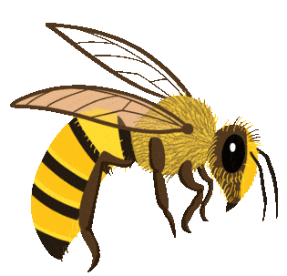

# Hey, I'm Kaumini Adikari 

## 👩‍💻 About Me 

I am a motivated, hardworking 3rd year Computer Engineering undergraduate at the University of Peradeniya, Sri Lanka. I have a strong foundation in software engineering and programming principles.

## 🚀 Programming Skills Highlights 

- **Programming Languages:** Python, Java, C
- **Database Systems:** MySQL
- **Web Development:** HTML, CSS, JavaScript, React.js
- **Procedural Programming:** Arm Assembly
- **Mobile Programming:** Flutter/Dart
- **Arduino Programming:** Arduino C, Verilog HDL

## 🎓 Education 

- **BSc Engineering (Hons) | Faculty of Engineering | University of Peradeniya, Sri Lanka (2021 - Present)**
  - Specialization: Computer Engineering

- **Mahamaya Girls’ College | Kandy, Sri Lanka (2006 – 2019)**

## 🛠️ Projects 

- **[Smart Beehive Monitoring System](https://github.com/cepdnaclk/e19-3yp-beehive-monitoring-system)  | Group Project | 2023 – Present**
  - Implemented a Smart Beehive Monitoring System aimed at detecting early signs of absconding in bee colonies. 
  - Technologies: Raspberry Pi, AWS S3, IoT Core, Lambda, Node.js, React.js, MongoDB

- **[Cricket Analytics and Prediction](https://github.com/cepdnaclk/e19-co544-cricket-analytics-and-prediction)  | Group Project | Ongoing**
  - Analyzed International T20 cricket matches to extract valuable insights and predict player impact.
  - Technologies: scikit-learn

- **[Digital Reporting System for Technical Visits](https://github.com/cepdnaclk/e19-co227-digital-reporting-of-technical-visits) | Group Project | 2023 – Present**
  - Developed a user-friendly software application for creating detailed reports during on-site visits for technical services.
  - Technologies: Flutter, React.js, Firebase

- **[Restaurant Management System](https://github.com/cepdnaclk/e19-co226-database-management-system-for-a-restaurant)  | Group Project | 2023**
  - Implemented a restaurant management system with a user-friendly database system.
  - Technologies: MySQL, React.js, Spring Boot

- **[Baby Development Tracking System](https://github.com/cepdnaclk/e19-co225-Baby-Developing-Tracking-System-Web-Application)  | Group Project | 2023**
  - Developed a comprehensive platform for monitoring child growth and milestones.
  - Technologies: React.js, Spring Boot, MySQL, Swagger

## 📞 Contact Information 

- **Email:** [kau.adikari@gmail.com](mailto:kau.adikari@gmail.com)
- **GitHub:** [19Kaumini](https://github.com/19Kaumini)
- **LinkedIn:** [Kaumini Adikari](https://www.linkedin.com/in/kaumini-adikari-b345b6204/)
